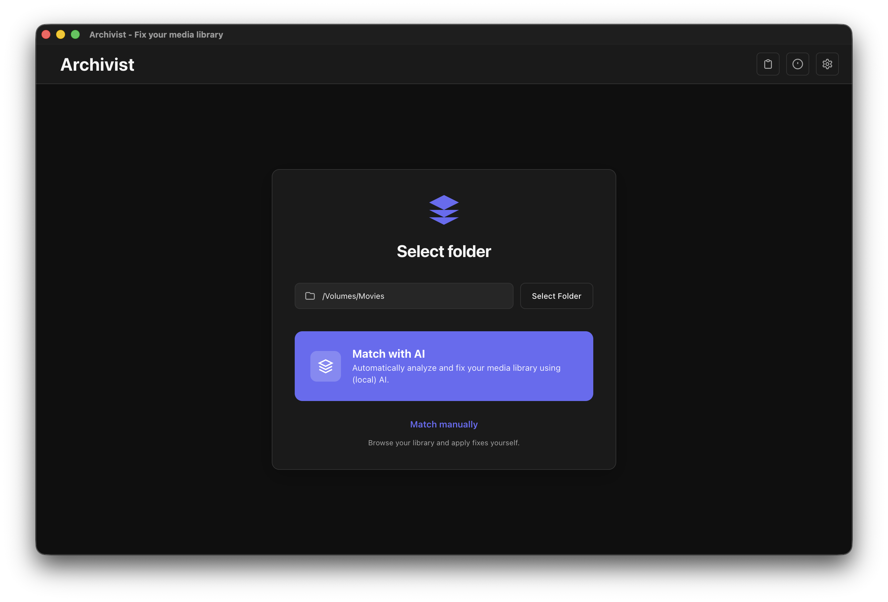
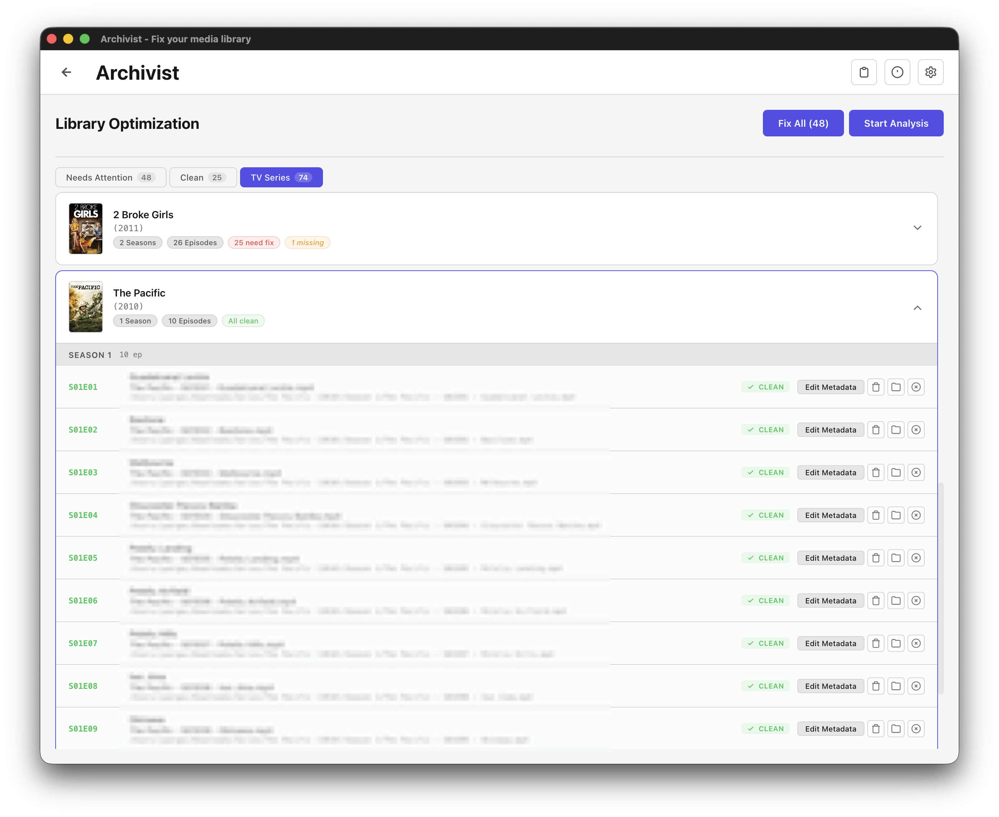
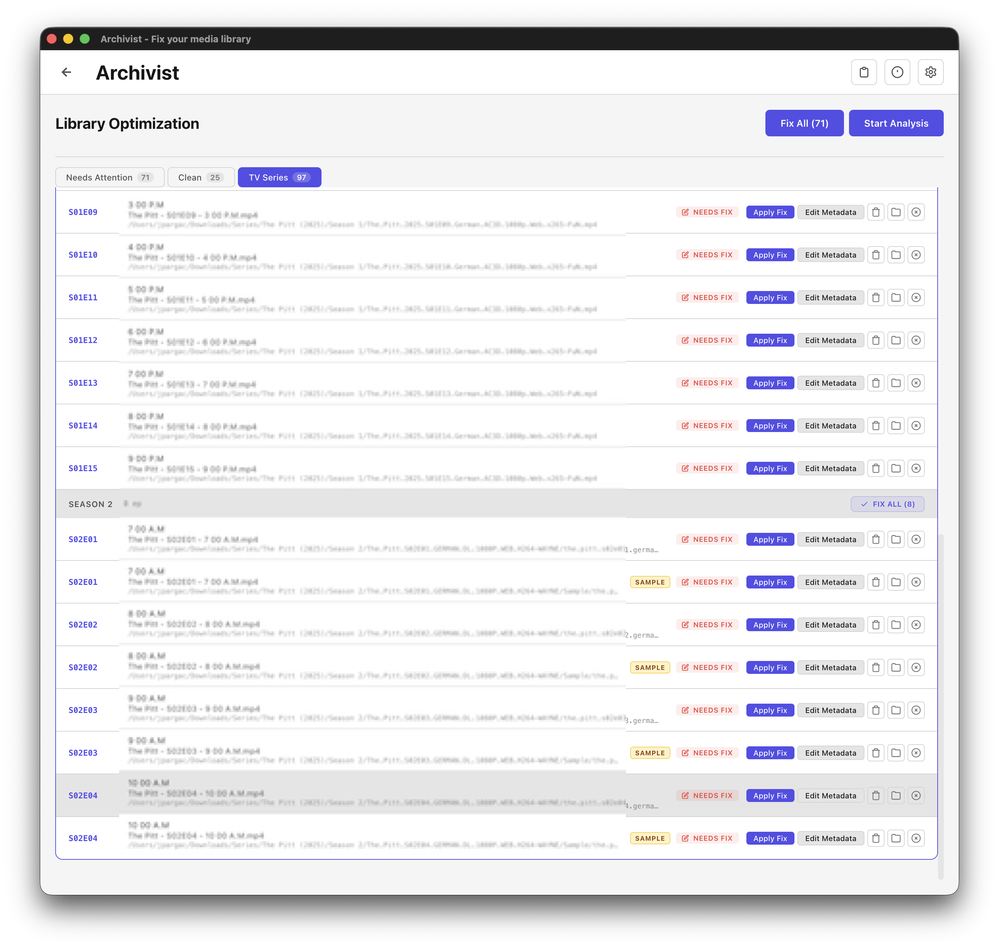
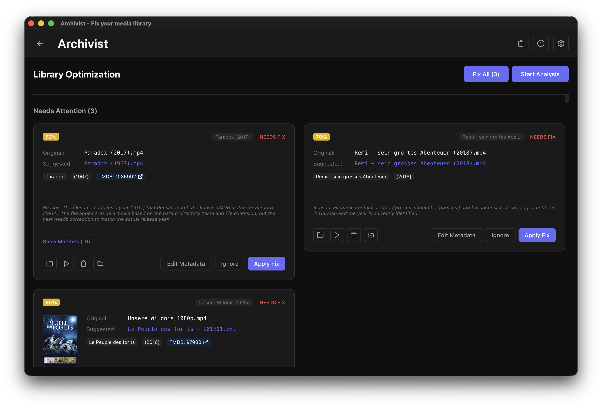
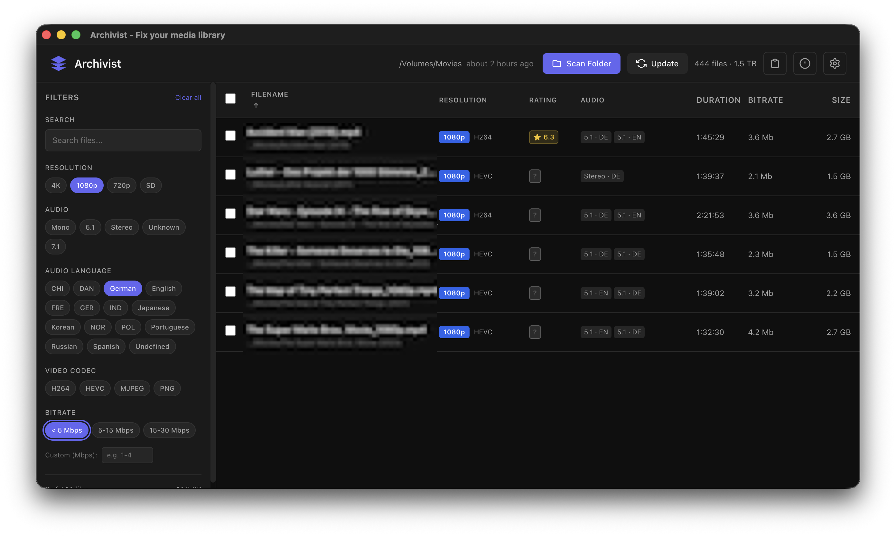
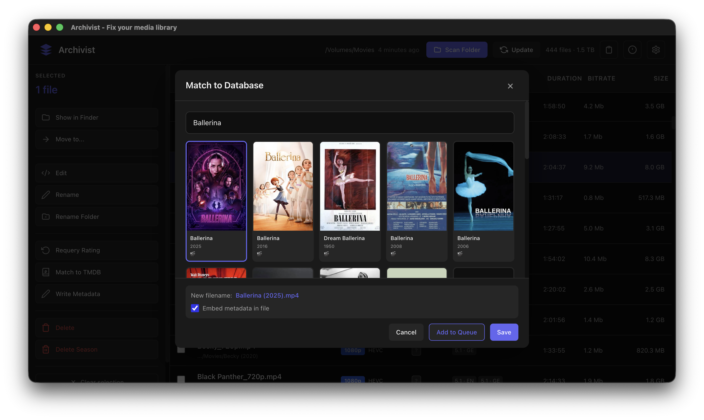

# Archivist

A modern, cross-platform desktop application for managing and organizing your media library. Built with Electron and Angular, Archivist provides powerful tools for scanning, filtering, and maintaining your video collection.



## Features

### 🧠 Intelligent AI Analysis

Transform your media library with AI-powered curator tools.
Use **local LLM** via ollama or provide your own api key for openai, claude, google sdks.

- **Smart Normalization**: Aggressive name normalization and conflict detection.
- **Confidence Scoring**: Color-coded confidence scores for AI matches.
- **TMDB Integration**: Automatic poster fetching and direct links to metadata sources (BYOK).
- **Batch Processing**: High-performance, multi-threaded scanning worker.
- **TV Series Organization**: Automated grouping of episodes into seasons with "Missing Episode" detection.







### 🔍 Advanced Filtering & Sorting

- **Rich Metadata**: Filter by resolution, codec, audio tracks, bitrate, and more.
- **Incremental Scanning**: Local state persistence ensures only new files are processed.
- **SQLite Caching**: High-speed database layer for instant library loading.
- **Global Search**: Instant feedback as you type across your entire collection.



### 🎬 Seamless Integration

- **VLC Playback**: Direct integration for launching files in VLC.
- **System Explorer**: Locate files on disk.
- **Metadata Embedding**: Edit and embed metadata directly into media files.



### 🌍 Internationalization

Archivist is fully localized for:

- 🇺🇸 **English**
- 🇸🇪 **Svenska**
- 🇩🇪 **Deutsch**

---

### Building

I provide versions for Windows and macOS for convenience. You can find the latest builds in the releases section. However, since I do not own a paid Apple Developer account, I cannot sign the application for macOS. You will need to sign the application yourself if you want to run it on macOS or bypass the security settings.

You can build the application for different platforms using the following commands:

Intel Mac:

```bash
bun archivist:mac
```

Apple Silicon Mac:

```bash
bun archivist:mac:arm64
```

Windows:

```bash
bun archivist:win
```

Linux:

```bash
bun archivist:linux
```

Linux ARM64:

```bash
bun archivist:linux:arm64
```

## License

GNU GENERAL PUBLIC LICENSE v3.0
