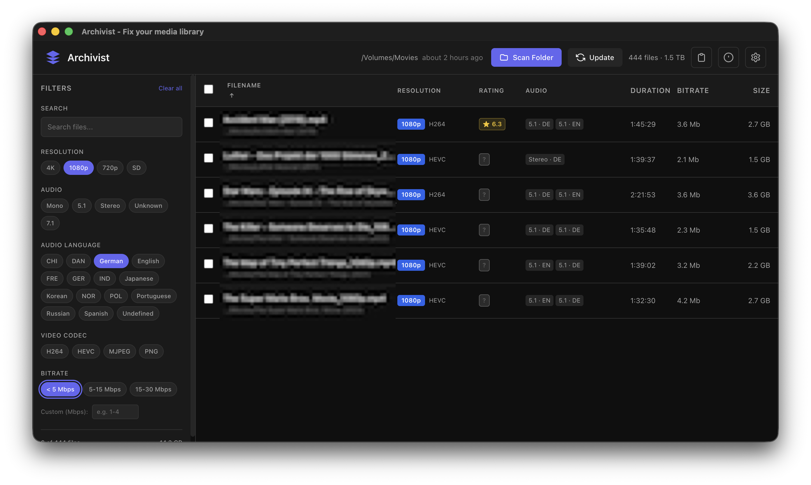

# Archivist

A modern, cross-platform desktop application for managing and organizing your media library. Built with Electron and Angular, Archivist provides powerful tools for scanning, filtering, and maintaining your video collection.


## Features

**Filtering** - Filter by resolution, codec, audio tracks, bitrate, and more



**Rating Integration** - Fetch ratings and metadata from TMDB/OMDB automatically (provide your own API key)
**Metadata Editing** - Edit and embed metadata directly into your files


**FFmpeg Integration** - Built-in FFmpeg support for media analysis and conversion


**Dark/Light Themes** - Beautiful UI with theme support

**Multi-language** - Internationalization support (for now eng, ger, swe)


## Prerequisites

- [Bun](https://bun.sh/) (v1.0+)
- [Node.js](https://nodejs.org/) (v20+)
- [FFmpeg](https://ffmpeg.org/) (bundled automatically)


## Installation

> Always check the [build instructions](https://www.electronjs.org/docs/latest/development/build-instructions-gn) for your platform.

```bash
# Clone the repository
git clone https://github.com/blackfan23/archivist.git
cd archivist

# Install dependencies
bun install
```

## Development

```bash
# Start the development server
bunx nx serve archivist
```

This will launch the Electron app with hot-reload enabled for both the frontend and main process.

## Building

### macOS

```bash
# Apple Silicon (M1/M2/M3)
bun run archivist:mac:arm64

# Intel
bun run archivist:mac
```

### Windows

```bash
bun run archivist:win
```

### Linux

```bash
# x64
bun run archivist:linux

# ARM64
bun run archivist:linux:arm64
```

The built application will be available in `dist/executables/`.

## Project Structure

```
apps/archivist/
├── electron/           # Electron main process
│   └── src/
│       ├── app/        # Main process logic
│       │   ├── services/   # IPC handlers, storage, ffmpeg
│       │   └── options/    # Build configuration
│       └── main.ts     # Entry point
└── frontend/           # Angular frontend
    └── src/
        ├── app/
        │   ├── components/ # UI components
        │   ├── core/       # Services and stores
        │   └── shell/      # Main layout
        └── styles.scss     # Global styles
```

## License

GNU GENERAL PUBLIC LICENSE v3.0

## Contributing

Contributions are welcome! Please feel free to submit a Pull Request.
